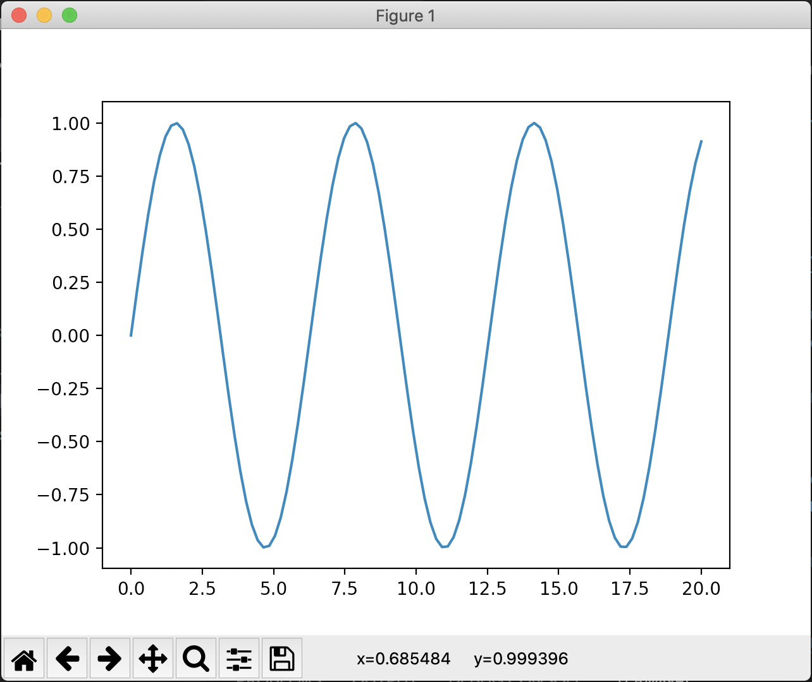

# How To Install And Use Packages in Python With VSCode 
### And get a nice graph

https://code.visualstudio.com/docs/python/python-tutorial#_install-and-use-packages

- try running the program... (press the play button in vscode)
"ModuleNotFoundError: No module named 'matplotlib'"

- use the Command Palette (Shift+Cmmd+P) to run `Terminal: Create New Integrated Terminal` (⌃⇧`). This command opens a command prompt for your selected interpreter.

*A best practice among Python developers is to avoid installing packages into a global interpreter environment. You instead use a project-specific virtual environment that contains a copy of a global interpreter. Once you activate that environment, any packages you then install are isolated from other environments. Such isolation reduces many complications that can arise from conflicting package versions. To create a virtual environment and install the required packages, enter the following commands*

1. Create and activate the virtual environment

*Note: When you create a new virtual environment, you should be prompted by VS Code to set it as the default for your workspace folder. If selected, the environment will automatically be activated when you open a new terminal.*

For macOS/Linux
python3 -m venv .venv
source .venv/bin/activate

2. Select your new environment by using the Python: Select Interpreter command from the Command Palette (Shift+Cmmd+P). (Should already be selected as ./.venv/bin/python3)

3. Install the packages
macOS
python3 -m pip install matplotlib

4. Rerun the program now and after a few moments a plot window appears with the output.

5. Once you are finished, type deactivate in the terminal window to deactivate the virtual environment.

-----------------------------------------------------

### Next steps

https://code.visualstudio.com/docs/python/python-tutorial#_next-steps

*You can configure VS Code to use any Python environment you have installed, including virtual and conda environments. You can also use a separate environment for debugging. For full details, see Environments.*

*To learn more about the Python language, follow any of the programming tutorials listed on python.org within the context of VS Code.*

*To learn to build web apps with the Django and Flask frameworks, see the following tutorials:*

*Use Django in Visual Studio Code*
*Use Flask in Visual Studio Code*
*There is then much more to explore with Python in Visual Studio Code*